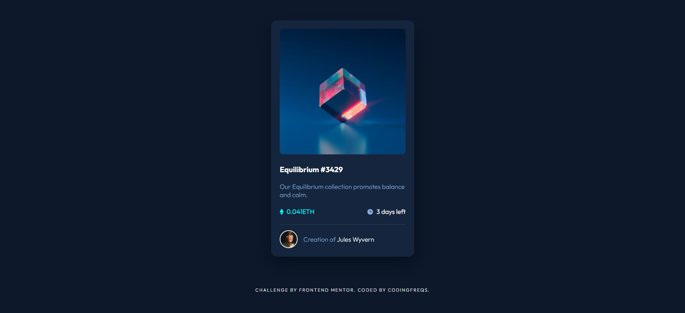

# Frontend Mentor - NFT preview card component solution

This is a solution to the [NFT preview card component challenge on Frontend Mentor](https://www.frontendmentor.io/challenges/nft-preview-card-component-SbdUL_w0U). Frontend Mentor challenges help you improve your coding skills by building realistic projects.

### The challenge

Users should be able to:

- View the optimal layout depending on their device's screen size
- See hover states for interactive elements

### Screenshot

### Links

- [Live Site URL](https://jongvelasquez.github.io/nft-preview-card-component/)

### Built with

- Semantic HTML5 markup
- BEM Naming
- CSS custom properties
- Flexbox
- Mobile-first workflow

### What I learned

I learned using flexbox and bem naming, proper placing of html elements and learn how to build html and css in a good ui design project.

### Continued development

I will build more projects and challenges in frontend mentor.

## Author

- Frontend Mentor - [@jongvelasquez](https://www.frontendmentor.io/profile/jongvelasquez)
- Twitter - [@codingfreqs](https://twitter.com/jaimewebuxui)

## Acknowledgments

Thank for frontend mentor team who build lot of challenges. I
